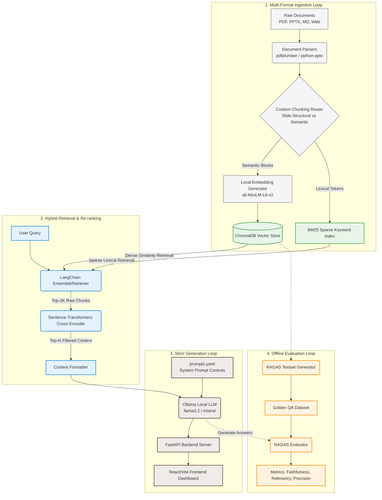

# 📚 Enterprise RAG Architecture

A production-grade, local-first Retrieval-Augmented Generation (RAG) system engineered for high-fidelity document Q&A. This system addresses critical enterprise challenges—such as vocabulary mismatch, context noise, and hallucination—by implementing a hybrid retrieval strategy, cross-encoder re-ranking, structural chunking, strict system prompt governance, and automated evaluation.

---

<p align="center">
  
  
  
  
  
  
  
  
  
</p>

---

## 🎯 System Overview

### The Problem
Most RAG prototypes rely on simple vector database searches over naive text chunks. In enterprise environments, this approach fails in production due to:
1. **Vocabulary Mismatch:** Semantic search struggles to locate exact domain-specific tokens, such as acronyms, product serial codes, or financial project names (e.g., "Project Aegis").
2. **Context Noise & Window Exhaustion:** General semantic search retrieves irrelevant chunks, filling the LLM context window with noise and causing the model to miss key facts.
3. **Loss of Slide/Table Structure:** PowerPoint presentations and reports lose layout information when processed by generic character splitters.
4. **Hallucination & Lack of Verification:** Default prompts cause LLMs to make up answers when the source documents lack information, with no citation audit trail.

### The Solution
This project implements an **enterprise-grade, local-first RAG pipeline** to solve these issues. It parses PDFs, PPTXs, Markdown, and Web pages into structural chunks, fuses sparse keyword search (BM25) with dense semantic search (ChromaDB), filters context through a cross-encoder re-ranking model, enforces citation constraints via central prompt governance, and runs offline QA evaluation metrics (RAGAS) to catch regression issues.

The system runs **100% locally** (zero paid API keys required by default) using CPU/GPU-based embeddings and Ollama local models, keeping sensitive data within the corporate firewall.

---

## 🏗️ System Architecture

The architecture separates concerns into a **User Interaction Loop** (Real-time API & UI) and an **Offline QA & Evaluation Loop** (Continuous regression testing).



---

## ⚡ Key Features

* **Hybrid Ensemble Retrieval (Sparse + Dense):** Fuses **BM25 Lexical Search** (for exact code, numbers, and acronym matches) with **ChromaDB Dense Semantic Search** (for intent understanding) using a weighted [EnsembleRetriever](file:///Users/vaibhavisingh/.gemini/antigravity/scratch/Enterprise_RAG_Architecture/src/rag_engine.py#L30) (0.3 sparse / 0.7 dense split).
* **Cross-Encoder Re-Ranking:** Candidates retrieved by the bi-encoder models are re-evaluated by a highly accurate cross-encoder model (`cross-encoder/ms-marco-MiniLM-L-6-v2`) to capture query-document token interactions and remove irrelevant noise before generation.
* **Preserving PPTX Slide Structures:** Slide decks are chunked on slide boundaries (`[Slide X]`) to keep lists and tables together as single logical contexts rather than splitting them mid-text.
* **Strict Citation Governance:** System prompts in [prompts.yaml](file:///Users/vaibhavisingh/.gemini/antigravity/scratch/Enterprise_RAG_Architecture/prompts.yaml) instruct the LLM to decline queries when context is lacking and require it to append explicit `[Source: filename]` citations to every statement.
* **CI-Gated Offline Evaluation (Ragas):** Evaluates retrieval precision, context recall, faithfulness, and answer relevancy against a golden dataset, enabling automated pipeline regression checks.

---

## 🧬 Step-by-Step Retrieval Pipeline

The intelligence layer processes questions through a structured, multi-stage pipeline:

```
[User Query] 
     │
     ├──► 1. Keyword Retrieval (BM25) ──┐ 
     │                                  ├─► 3. Reciprocal Rank Fusion ─► 4. Cross-Encoder Re-ranking
     └──► 2. Semantic Search (ChromaDB) ┘          (Weighted Combo)          (ms-marco-MiniLM-L-6-v2)
                                                                                  │
  [Pydantic Response] ◄── 6. Local LLM Generation ◄── 5. System Prompt Inject ◄───┘
 (Factual Answer + Citations)   (Ollama: Llama3.2)     (System prompts.yaml)
```

1. **Ingestion & Custom Parsing:** 
   * **PDFs** are extracted page-by-page using `pdfplumber`.
   * **PowerPoint Presentations (PPTX)** are parsed to preserve structure. The system identifies high-priority slides (e.g., project timeline, governance, methodology) using slide keywords and flags them in metadata to prioritize their retrieval.
   * **Markdown** and **Web Pages** are split using a semantic-aware recursive character splitter.
2. **Dense & Sparse Indexing:** Chunks are vectorized using a CPU-friendly `all-MiniLM-L6-v2` transformer model (384-dimensional space) and indexed in ChromaDB. Simultaneously, text chunks are indexed in a BM25 sparse keyword database.
3. **Hybrid Candidates Retrieval:** When a query arrives, the system retrieves the top 30 candidate chunks using a weighted fusion of dense vector and sparse keyword retrievers.
4. **Cross-Encoder Re-ranking:** The top 30 chunks are run through the `ms-marco-MiniLM-L-6-v2` cross-encoder. Unlike bi-encoders, the cross-encoder processes the query and chunk together to calculate token attention, scoring each chunk for direct relevance. The top 5 chunks are selected.
5. **Prompt Injection & Generation:** The selected chunks are formatted and injected into the system prompt configuration from `prompts.yaml`. The prompt is sent to a local Ollama instance running `llama3.2`.
6. **Structured Output:** The FastAPI endpoint formats the response into a Pydantic `ChatResponse` model, returning the answer string along with an array of `Evidence` objects (source file name, chunk text, cross-encoder relevance score, and timestamp) to render in the UI.

---

## 💡 Why This Is Not A Basic RAG Chatbot

| Feature | Basic RAG Tutorial | This Enterprise Architecture | Why it Matters in Production |
| :--- | :--- | :--- | :--- |
| **Retrieval Strategy** | Vector similarity only | Hybrid Search (BM25 + ChromaDB Vector Store) | Captures semantic context and resolves keyword mismatch (acronyms, product numbers). |
| **Context Refinement** | Passes raw vector results to LLM | Cross-Encoder Re-ranking | Filters out irrelevant chunks, saves context window space, and reduces hallucinations. |
| **Document Processing** | Simple chunk splitters | Custom slide-structural & semantic parsing | Keeps slide layouts and lists intact, preventing fragmented retrieval. |
| **Hallucination Control** | Standard LLM system prompt | YAML prompt rules + strict citation constraints | Forces the model to decline queries when evidence is missing, ensuring auditability. |
| **Evaluation Method** | Vibes-based manual testing | Ragas test generator + golden dataset testing | Uses quantitative metrics to prevent performance regressions after prompt changes. |

---

## 🔬 Evaluation & Quality Assurance

To ensure prompt updates, new documents, or vector database configuration changes do not degrade response quality, the system includes a quantitative evaluation pipeline powered by **Ragas**:

* **Faithfulness (Hallucination Metric):** Measures if the generated answer is strictly based on the retrieved context. It identifies the claims in the generated response and verifies them against the source chunks (Target: `> 0.90`).
* **Answer Relevancy:** Measures if the generated response directly addresses the user's question, penalizing redundant or incomplete answers (Target: `> 0.85`).
* **Context Precision:** Evaluates if the cross-encoder ranks the most relevant chunks at the top of the context window (Target: `> 0.80`).
* **Context Recall:** Verifies if the retrieval system fetches all necessary information to answer the question, checked against the ground truth.

### Regression Testing Loop
The pipeline generates evaluation questions and checks answer quality automatically:
1. Run `./tests/run_evaluation.sh` to extract database chunks and use the Ragas `TestsetGenerator` to generate a golden QA dataset.
2. The evaluator runs the QA agent against the questions, calculates metrics, and outputs results.
3. In a production pipeline, this can be integrated into GitHub Actions to block pull requests if evaluation scores drop.

---

## 🛠️ Technology Stack

| Component | Technology | Role |
| :--- | :--- | :--- |
| **Frontend** | React 18, Vite, Lucide-React, React-Markdown | Interactive UI, drag-and-drop document upload, and citation accordion rendering. |
| **Backend** | FastAPI, Uvicorn, Pydantic | High-performance API hosting, lazy-loaded singletons, and type-safe response contracts. |
| **Orchestration** | LangChain, LangChain-Community, LangChain-Chroma | RAG component orchestration and vector store integration. |
| **Vector DB** | ChromaDB (local directory storage) | Metadata-filtered dense vector search. |
| **Sparse Index** | Rank-BM25 | Lexical token search. |
| **Embeddings** | HuggingFace `all-MiniLM-L6-v2` | Zero-cost, local semantic vector generation. |
| **Re-ranking** | Sentence-Transformers `ms-marco-MiniLM-L-6-v2` | Cross-encoder relevance scoring. |
| **LLM Orchestration** | Ollama, Llama 3.2 (3B Parameters) | Local text generation. |
| **Evaluation** | RAGAS, Dataset, Pandas | Golden QA dataset generation and metric evaluation. |

---

## 🚀 Installation & Setup

### 1. Prerequisites
* Python 3.11+
* Node.js & npm
* **[Ollama](https://ollama.com/)** installed and running on your local machine.
* Download Llama3.2:
  ```bash
  ollama run llama3.2
  ```
  *(Press `Ctrl + D` to exit the interactive session after it downloads; keep the Ollama app running in the background).*

### 2. Backend Setup
Clone this repository and navigate to the directory:
```bash
git clone https://github.com/Haus-Nous/Enterprise_RAG_Architecture.git
cd Enterprise_RAG_Architecture

# Create a virtual environment
python3 -m venv venv
source venv/bin/activate

# Install dependencies
pip install -r requirements.txt
```

### 3. Frontend Setup
Open a new terminal window and set up the React application:
```bash
cd frontend
npm install
```

---

## 🏃 Running the Application

### Step 1: Start the FastAPI Backend
In your backend terminal, activate the virtual environment and start the server:
```bash
source venv/bin/activate
uvicorn api.main:app --reload
```
The backend API documentation will be available at `http://localhost:8000/docs`.

### Step 2: Start the React Frontend
In your frontend terminal, start the Vite development server:
```bash
npm run dev
```
Open your browser and navigate to `http://localhost:5173`.

### Step 3: Index Documents
1. Place your target PDFs in the `data/rfps/` folder and Markdown files in `data/markdown/`.
2. In the React web UI, click **"Re-Index Database"** in the sidebar. The system will parse the documents, compute embeddings, and initialize the BM25 index.

---

## 💬 Example Query & Response

### Request
```json
{
  "query": "What is the steering committee meeting frequency for Project Aegis?",
  "top_k": 5
}
```

### Response
```json
{
  "answer": "The Steering Committee (SteerCo) for Project Aegis meets **bi-weekly** to review workstream progress and approve deliverables [Source: Project_Aegis_Proposal.pptx]. Ad-hoc meetings can be requested by workstream leads if critical blockers arise [Source: governance_rules.md].",
  "evidence": [
    {
      "source_file": "Project_Aegis_Proposal.pptx",
      "content": "[Approach Slide 4] Governance: Steering Committee meets bi-weekly to review deliverables.",
      "similarity_score": 0.892
    },
    {
      "source_file": "governance_rules.md",
      "content": "Ad-hoc SteerCo sessions are triggered by workstream leads under critical blocker conditions.",
      "similarity_score": 0.745
    }
  ],
  "execution_time_seconds": 1.48
}
```

---

## 📈 Future Improvements

* **Intent Routing:** Use a lightweight classification model to route casual queries (like greetings or conversational interactions) away from the RAG pipeline, saving compute resources.
* **Parent-Document Retrieval:** Index smaller text chunks for vector matching, but return larger parent document contexts to the LLM to provide richer context for generation.
* **Hierarchical PDF Layout Parsing:** Integrate layout-aware parsing libraries (such as `Unstructured` with document layout models) to extract tables and charts from complex PDFs as markdown tables.
* **Semantic Query Caching:** Add a local semantic cache (e.g., using GPTCache) to store and retrieve answers to common questions instantly without running the RAG pipeline.

---

## 🧠 Lessons Learned & Design Tradeoffs

1. **Re-ranker Cost vs. Latency:** Adding the Cross-Encoder re-ranker improves retrieval precision and reduces noise, but it adds roughly 150ms of CPU latency per query. For enterprise Q&A where accuracy is paramount, this is a highly acceptable tradeoff.
2. **Slide-Level Structural Chunking:** Slide presentation content is dense. Splitting slides by arbitrary character counts makes the context hard to follow. Restructuring slide chunking around slide boundaries (`[Slide X]`) preserves context layout, improving retrieval accuracy.
3. **Local Deployment Constraints:** Running Ollama models (like Llama 3.2 3B) locally preserves data privacy, but execution speeds depend on the host machine's hardware. On Apple Silicon (M-series) or machines with dedicated GPUs, generation takes under 1.5 seconds, while older CPU-only systems can experience latency.
