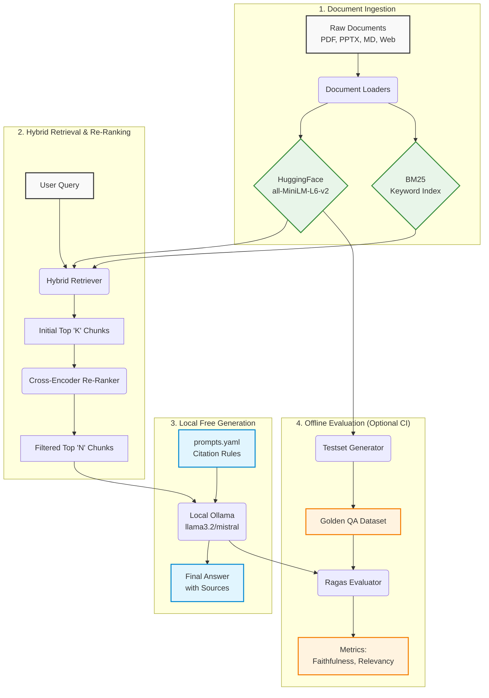

# 📚 Enterprise RAG Architecture

A production-ready Retrieval-Augmented Generation (RAG) application designed for the enterprise. 

This system provides highly accurate, domain-specific Q&A over varied document types (PDFs, PPTXs, Markdown, Web Pages). It goes beyond a simple vector-search prototype by implementing **Hybrid Retrieval**, **Cross-Encoder Re-Ranking**, **Strict Citation Enforcement**, and an automated **Offline Evaluation Pipeline**.

---

## 🌟 Key Features

* **Hybrid Retrieval (`EnsembleRetriever`)**
  Maximizes recall by fusing traditional **BM25 Keyword Search** (great for exact matches like product IDs or acronyms) with **ChromaDB Semantic Vector Search** (great for understanding intent and context).
  
* **Cross-Encoder Re-Ranking (`sentence-transformers`)**
  Passes the initially retrieved chunks through a highly precise cross-encoder model (`cross-encoder/ms-marco-MiniLM-L-6-v2`). This dynamically scores, filters, and ranks the context, ensuring only the highest relevance information is passed to the generative model.

* **Strict Citation & Hallucination Governance**
  System prompts (managed in a central `prompts.yaml`) are explicitly designed to force the LLM to:
  1. Append `[Source: filename]` citations to all factual claims.
  2. Outright decline queries if the context lacks the evidence required to answer.

* **CI-Gated Offline Evaluation (`ragas`)**
  A fully automated evaluation pipeline that generates a golden dataset and measures *Faithfulness* and *Answer Relevancy*. It is wired into robust GitHub Actions to prevent prompt or retrieval regressions on pull requests.

---

## 🏗️ System Architecture

The workflow is divided into two primary loops: the **User Interaction Loop** (Retrieval & Generation) and the **Offline Evaluation Loop** (Quality Assurance).



---

## 📂 Repository Structure

The codebase is organized cleanly to separate the UI, the core RAG logic, and the evaluation tools:

```text
├── .github/workflows/         # CI/CD Pipeline configuration (evaluate_rag.yml)
├── data/                      # Local storage dropping ground
│   ├── chroma_db/             # Local Chroma DB persistence
│   ├── markdown/              # Directory for .md files
│   └── rfps/                  # Directory for .pdf files
├── src/
│   ├── rag_engine.py          # Core Ingestion, Hybrid Retrieval & Re-Ranking logic
│   ├── qa_agent.py            # LLM Orchestrator with strict citation enforcement
│   └── data_models.py         # Pydantic schemas enforcing data validation (e.g., Evidence)
├── tests/
│   ├── create_eval_dataset.py # Automated generation of Golden QA pairs
│   ├── evaluate_rag.py        # Offline evaluation using Ragas
│   └── run_evaluation.sh      # Bash wrapper for the CI pipeline
├── app.py                     # Streamlit frontend User Interface
├── prompts.yaml               # Centralized, version-controlled system prompts
└── requirements.txt           # Python dependencies
```

---

## 🚀 Quick Start Guide

### 1. Prerequisites
- Python 3.11+
- Node.js & npm (for the React Frontend)
- **[Ollama](https://ollama.com/) installed locally** with `llama3.2` downloaded (`ollama run llama3.2`)

### 2. Backend Setup (FastAPI)
Clone the repository and set up the python environment for the intelligence layer:

```bash
git clone https://github.com/yourusername/ask-my-docs.git
cd ask-my-docs

# Create and activate virtual environment
python3 -m venv venv
source venv/bin/activate  # On Windows: venv\Scripts\activate

# Install requirements
pip install -r requirements.txt
```

Start the FastAPI backend server:
```bash
uvicorn api.main:app --reload
```
This will start the backend at `http://localhost:8000`.

*(Note: The system requires absolutely no paid API keys. It uses HuggingFace `all-MiniLM-L6-v2` locally for embeddings, and connects to your local Ollama port `11434` for LLM generation!)*

### 3. Frontend Setup (React)
Open a **new terminal tab**, navigate to the frontend directory, and start the Vite development server:

```bash
cd ask-my-docs/frontend
npm install
npm run dev
```

> **Getting Started Tip**: On your first run, the database will be empty. Drop some `.pdf` files into `data/rfps/` or `.md` files into `data/markdown/`, open the React UI at `http://localhost:3000`, and click **"Re-Index Database"** in the Sidebar.

---

## 🔬 Offline Evaluation Pipeline

To guarantee the quality of the LLM answers and prevent silent regressions when making changes, the repository includes a self-generating, robust offline evaluation pipeline.

You can trigger the evaluation locally via:
```bash
./tests/run_evaluation.sh
```

**What this script does:**
1. **Dataset Generation**: Reads your loaded vector documents and uses the `Ragas TestsetGenerator` to synthesize an incredibly realistic ground-truth QA dataset.
2. **Execution**: Runs the `AskMyDocsAgent` against these generated questions.
3. **Metric Calculation**: Computes advanced RAG metrics (Faithfulness, Answer Relevancy, Context Precision) using an LLM-as-a-judge approach.
4. **Validation**: Reports the final scores, which can be monitored to ensure changes to text splitters, embedding models, or prompts do not negatively impact the system.

This script is automatically executed via **GitHub Actions** on every Pull Request targeting the `main` branch.
